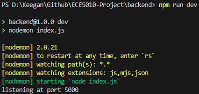
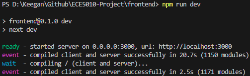

# Setup:
if either Node.js or npm are not installed on your machine, follow [this](https://phoenixnap.com/kb/install-node-js-npm-on-windows) tutorial to install it on your machine. Once completed you can install the project's dependencies, from the root of the project directory:
## *backend*
 - cd backend
 - npm i
## *frontend*
 - cd ../frontend
 - npm i

# Usage:
Once the above packages are installed, open two terminals. In the first terminal, from the root of the project directory, start the server side of the project: 
 - cd .\backend\
 - npm run dev
  
if the following is printed to the terminal you may proceed to starting the client side of the project

In the second terminal, start the client side of the project:
 - cd ..\frontend\
 - npm run dev

if the following is printed to the terminal, Scaled is now running and you may proceed to the [website](http://localhost:3000/)

